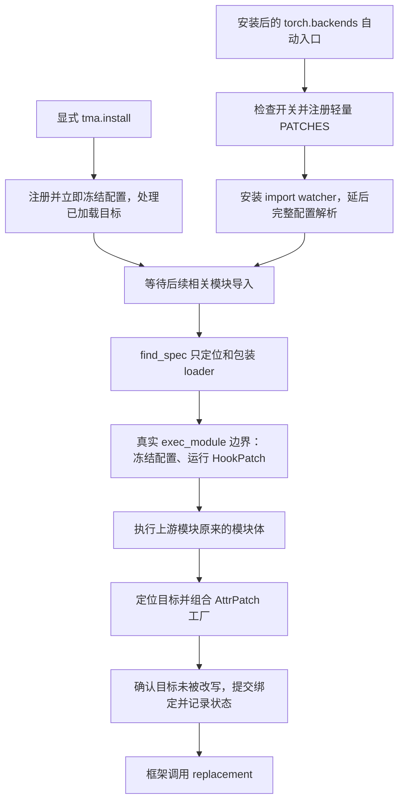

# 贡献指南

[用户指南](README.md) · [Agent 规范](AGENTS.md) · [设计入口](docs/design.md) · [补丁台账](docs/PATCH_LEDGER.md)

本指南面向编写、审查和维护适配代码的开发者。目标是让每个补丁的目标、条件、行为和
退出依据在一个文件内可以读懂，并用验证证据限制它的适用范围。Coding agent 还需遵守
[AGENTS.md](AGENTS.md) 中的工作流程。

## 1. 从调用链理解架构

一个普通适配沿着这条路径工作：**框架模块加载 → 引擎定位属性 → 工厂构造 replacement
→ 引擎写入属性 → 框架调用 replacement**。多实现 attention 才进一步调用共享的选择函数。

| 代码位置 | 负责什么 |
|---|---|
| [`activation.py`](src/training_musa_adaptor/activation.py) | 自动/显式入口、轻量注册与公开 API |
| [`_config.py`](src/training_musa_adaptor/_config.py) | 配置来源、校验、优先级与冻结 |
| [`_imports.py`](src/training_musa_adaptor/_imports.py) | 包装目标模块的 loader，在真实执行边界调用引擎 |
| [`_engine.py`](src/training_musa_adaptor/_engine.py) | 两种补丁记录、依赖顺序、目标绑定、回滚、撤销和状态 |
| [`_compat.py`](src/training_musa_adaptor/_compat.py) | 目标解析、版本门控和源码探针 |
| [`patches/`](src/training_musa_adaptor/patches) | 按框架和领域组织具体工厂、Hook 与 PATCHES |
| [`backends/`](src/training_musa_adaptor/backends) | 共用设备检查和 torchada 接入后的接口补偿 |
| [`ops/`](src/training_musa_adaptor/ops) | 确有共享调用方的 attention/GDN 普通函数 |

`_engine.py` 和 `_imports.py` 不知道某个 tensor、模型或 kernel 的语义。普通补丁不需要
新增 planner、provider、action 或通用算子协议。单一调用点的转换留在自己的补丁文件；
出现第二个真实调用方后，再提取语义相同的部分。

## 2. 补丁什么时候生效



### 自动与显式入口

安装后的 `torch.backends` entry point 在 `import torch` 的末尾调用
`torch_backend_autoload()`。该回调只读取启动开关、注册轻量定义、安装 watcher，
完整 TOML 与版本解析在安全边界进行。仅导入本包不安装任何补丁。

显式 `tma.install(config_path=...)` 立即解析并冻结配置，处理已经完整导入的属性目标。
它不能补跑已经错过导入前边界的 Hook；此类 Hook 记录 `skipped` 和 `phase_missed`。
`apply(patch_ids=(... ,))` 用于按指定 ID 主动导入目标，不能省略 ID 请求全量导入；
它不是独立的补丁白名单，相关模块导入时仍按正常配置调度其他补丁。

框架先导入、在模块体内才导入 torch 时，watcher 可能错过正在执行模块的 loader。
平台层已有部分经过审查的较晚触发点；它们不能自动覆盖所有属性补丁。
新增框架接入必须测试真实导入顺序，不能仅在测试开始调用 install 后就声称自动入口通过。

### 导入边界

- Hook 在真实 `exec_module` 之前执行，AttrPatch 在模块体成功执行之后应用。
- 本库不能在 finder 查询时执行 Hook。Python 查询子模块 spec 本身可能导入父包，
  需要区分 Python 的行为与本库额外添加的副作用。
- namespace 根包没有可执行模块体，不能拿来当导入前 Hook 边界。
- 被监听的 LazyLoader 目标会转为实际执行后再交付；无关模块不受影响。
- 未使用框架保持 pending/skipped。不要为了让报告“全绿”主动导入所有目标。

### 所有权、失败与撤销

同一目标上先登记 A、后登记 B，组合得到 `B(A(original))`。工厂均成功后才提交这个目标链。
事务范围是**一个目标及其相关别名写入**，不是整个框架导入；此前已经成功的独立目标不会
因为另一个目标失败而被描述成全部回滚。

引擎保存原对象、replacement、属性是否自有及有限别名。提交前检查目标身份，避免覆盖
工厂执行期间的第三方改写。晚注册重建后若所有工厂都拒绝，先恢复仍由本包拥有的
原绑定和别名，再移除清理记录；继承属性通过删除覆盖恢复。工厂不能自己给目标 setattr；
Hook 自己管理的变更则必须有所有权保护，失败时自行清理部分结果。

`uninstall()` 逆序恢复当前仍等于本包 replacement 的对象，保留第三方后写对象。
继承属性恢复时删除本包新增的覆盖，保留 descriptor 绑定语义。清理失败保留重试信息，
禁止直接重装；无 undo 的 Hook 保留不可逆效果，不会在卸载后假装恢复或重复执行。

安装、注册和撤销应发生在训练前或隔离测试边界。没有训练运行中并发热切换保证；已有实例、
闭包、类基类、编译缓存和扩展注册也不能靠 setattr 完整恢复。不同配置实验使用新进程。

自动入口自身失败会记录错误以保护普通 `import torch`；watcher 可用时，后续相关边界
会抛出保存的错误。工厂或目标应用失败不能套用这一例外吞掉。报告的具体字段以
[`AppliedPatch.as_dict()` 和 `Engine.report()`](src/training_musa_adaptor/_engine.py) 为准。

## 3. 开发一个 AttrPatch

### 先定位问题

先复现一个具体调用点，记录上游文件/符号、发行包与源码 revision、实际输入和失败。
区分接口兼容、数值错误与性能优化：没有证据表明上游不支持的路径，不应先安装兜底。
优先替换一个函数或方法，避免复制上游模块、修改 site-packages 或替换整个框架。

下面是仓库中 [RMSNorm 补丁](src/training_musa_adaptor/patches/transformers/rms_norm.py)
的缩短说明版，展示完整写法；它已有注册，请勿再次添加同一个 ID：

```python
# 位于 patches/transformers/ 内的补丁模块。
from functools import wraps

from ..._engine import AttrPatch


def replace_rms_norm(original):
    import torch  # 目标加载完成后才导入运行时依赖。

    @wraps(original)
    def forward(self, hidden_states, *args, **kwargs):
        if (
            args or kwargs
            or type(hidden_states) is not torch.Tensor
            or hidden_states.device.type != "musa"
            or self.weight.device != hidden_states.device
            or hidden_states.dtype != self.weight.dtype
            or hidden_states.dtype not in (torch.float16, torch.bfloat16)
        ):
            return original(self, hidden_states, *args, **kwargs)
        return torch.rms_norm(
            hidden_states, (hidden_states.shape[-1],),
            self.weight, self.variance_epsilon,
        )

    return forward


PATCHES = (
    AttrPatch(
        id="transformers.qwen3-vl.text-rms-norm.fused-torch",
        target="transformers.models.qwen3_vl.modeling_qwen3_vl:Qwen3VLTextRMSNorm.forward",
        replace=replace_rms_norm,
        version_gates=("transformers >=4.57",),
        rationale="约定输入上的 RMSNorm 小算子链有多次 kernel launch 开销",
        strategy="同设备、同 dtype 的普通 fp16/bf16 MUSA tensor 使用融合算子，其他输入保留原路径",
        upstream="transformers/models/qwen3_vl/modeling_qwen3_vl.py:Qwen3VLTextRMSNorm.forward",
        remove_when="上游提供等价实现后，禁用补丁重跑正确性和性能回归，再移除",
    ),
)
```

本例 dtype 和设备条件是正确性边界：去掉 dtype 匹配会改变参数与激活类型不同时的
输出提升规则。`wraps` 保留可读元信息，但不自动保证签名、返回结构、autograd 或 RNG 等价。

### 工厂和字段约定

| 项目 | 开发要求 |
|---|---|
| `id` | 稳定、明确描述行为；保持既有 ID 的语义稳定，变体另起 ID 并记录关系 |
| `target` | 精确 `module:attribute` 或 `module:Class.method`，不是文件路径 |
| `replace(current)` | 只构造 replacement；`None` 表示主动放弃，异常表示失败；返回 `False` 可合法替换布尔属性 |
| `rationale` | 写触发条件、上游问题/开销和证据，不能只有“兼容 MUSA” |
| `strategy` | 写适用条件、保留的语义、回退行为、资源或性能代价 |
| `upstream` | 可定位的上游路径/符号，必要时附 revision、issue 或测试依据 |
| `remove_when` | 可执行的退役条件和回归方法，不能只有“以后上游修复时删除” |
| `version_gates` | 必须对照上游不同版本源码确定范围，记录上下界依据；同时保留设备/输入能力检查 |

在 [`patches/__init__.py`](src/training_musa_adaptor/patches/__init__.py) 显式导入新模块并加入
`MODULES`；若只是已有模块新增记录，只更新该模块的 `PATCHES`。注册顺序属于行为，不为
排序整齐随意改动。普通补丁应无需修改引擎。

不要在补丁模块顶层导入 torch、框架、加速库或读取动态环境。顶层只用标准库和本包轻量
定义；依赖导入放在工厂或已审查的安全初始化边界。wrapper 必须捕获传入的原始句柄，
不能重新读取已被自己替换的公开属性而递归调用。

### 前置依赖与别名

`requires=("companion.id",)` 仅支持**同一模块中不同属性**的 AttrPatch 前置。
缺失、禁用、门控排除或主动拒绝的前置使消费者 skipped；不会替用户开启前置。
循环、跨模块和同目标依赖会被拒绝。普通补丁也不得导入兄弟补丁或读取其私有 applied 状态。

`rebind_prefixes` 默认空。仅有证据证明 `from module import function` 的同名旧引用需要
修复时，填写最小前缀范围。它不是全进程引用修复机制；不同别名名、闭包、已有实例和
类基类不会自动更新。另一个框架有独立调用点时，通常应单独声明目标并共享普通函数，
如 [`mcore_bridge/ssm.py`](src/training_musa_adaptor/patches/mcore_bridge/ssm.py)。

### 什么时候需要 HookPatch

只有必须在模块体执行前完成的准备才使用 Hook，例如模块初始化时会读取设备接口。
参考 [`patches/platform.py`](src/training_musa_adaptor/patches/platform.py)。

- 指定真实、可执行、先于被准备行为的 `trigger` 模块。
- `run()` 返回 **False** 表示拒绝；返回 None/True 均算完成，不要与 AttrPatch 的 None 混淆。
- `undo()` 只撤销自己仍拥有的修改；重复调用与清理失败需有回归。
- run 中途失败由 Hook 清理部分结果并传播原错；引擎不替它推断外部副作用。
- 没有可靠 undo 时明确记录不可逆原因，并验证 uninstall/reinstall 不重复执行。
- Hook 内不执行训练、collective 或无边界的设备/JIT 预热；不要把导入边界当全局初始化框架。

## 4. 版本、配置和多实现的边界

版本门控通过 `_compat.py` 在安全边界延迟使用 packaging，按标准版本解析并显式考虑
预发布版本。发行名与 import 名可能不同，例如 `megatron-core` 与 `megatron.core`。
ABI、厂商 fork、实际符号和能力仍需核实；缺失元数据不构成兼容证明，已知越界也不能用
探针绕过。没有生产用全局 ignore gate 开关。

当前 Megatron 门控依据见 [`patches/megatron/__init__.py`](src/training_musa_adaptor/patches/megatron/__init__.py)。
源码核对到某版本只证明对应接口仍存在，不代表整个版本硬件验证通过。接口发生变化时，
优先用独立、范围不重叠的变体补丁保持函数清晰；必须验证边界、厂商版本后缀和旧版本行为。

### 用上游多版本源码确定 version_gates

**新建补丁、修改其目标/调用契约或调整门控范围时，必须检查所适配开源仓库不同版本的
实际源码，再确定 `version_gates`。** 本机安装版本、release notes、语义化版本号或邻近
补丁的 gate 都不能单独作为依据。本节要求同样适用于 AttrPatch 和 HookPatch。
上面的 RMSNorm 示例展示现有记录的写法，不是其开放上界已完成多版本核查的证明；
不要把示例中的版本值直接用作新补丁模板。

按以下步骤完成核查：

1. **确定源码与发行版本的对应关系。** 记录上游仓库、发行包名、tag/release branch 及
   commit SHA；分支会移动，证据必须能定位到实际检查的提交。厂商 fork 另外记录 build、
   基于的上游版本和影响该调用点的差异，不能只按同名上游 tag 推断厂商行为。
2. **列出补丁依赖的完整契约。** 核对目标模块/符号、函数签名与默认值、调用方传参、
   返回值/辅助状态、配置字段、执行时机，以及补丁所依赖的内部行为与原问题是否仍存在。
   符号同名或签名未变不等于语义兼容；Hook 还需核对触发模块及被准备行为的先后关系。
3. **比较拟支持范围内的不同版本。** 至少核对拟定下界、可获得的相邻更早版本、范围内
   各发布线和最新拟支持版本；通过目标与调用方的版本 diff/历史定位中间变化，再阅读
   变化前后的源码。不能只检查区间两端就推断所有中间版本兼容，也不能忽略 patch release
   或 backport 对契约的影响。无法取得源码的版本记录为未核实，不扩入声称已核实的范围。
4. **逐补丁推导边界。** 下界来自补丁所需契约开始成立的版本，而非当前测试机版本。
   上界优先取目标移除/改名、调用契约不兼容或补丁已不应应用的第一个版本，并核对边界
   两侧。若还没观察到不兼容版本，只能设置有说明的保守核查边界，标明源码核对截止处，
   不把未知后续版本写成已兼容，也不将保守边界声称为已证实的不兼容点。中间有例外时
   明确排除该版本或拆分变体；相关 TE 等依赖各自核对，不能用一个框架 gate 代替所有依赖。
5. **验证声明与记录证据。** 用本项目真实版本解析验证范围内、范围外、上下界和适用的
   rc/dev/post/local 版本；变体要检查范围无意外重叠或空洞。版本比较测试只证明门控表达式，
   还需目标契约回归及相应运行验证。源码证据和实际执行结果分开登记。

例如，仅作说明：若 v1.5 尚无所需目标，v1.6/v1.7 的目标和调用契约均适用，v1.8 开始
调用方传入新的语义参数，旧 wrapper 可声明 `>=1.6,<1.8`，并为新契约另建变体。
这个结论必须来自这些版本及区间内相关变更的源码，不能套用到其他补丁。

在补丁邻近注释或维护说明中保留简明边界理由，在补丁台账对应 ID 条目或其链接的证据
记录中填写下面的对照；多个补丁只有契约和证据确实相同时才共用记录：

| 上游版本 / tag / commit | 目标及调用方源码位置 | 契约差异与补丁必要性 | 门控结论 | 实际验证 |
|---|---|---|---|---|
| 每个核查版本填写一行 | 固定提交链接或仓库相对路径 + SHA | 目标/调用/语义是否改变，问题是否仍在 | 纳入、排除、变体或未核实 | 源码核对、单元、硬件、训练分别注明 |

新补丁或范围变更缺少上述依据时，不能标记版本适配完成。源码核实不等于硬件验证，
单版本运行通过也不能代替跨版本源码核查；发布说明和 PR 应分别说明这两种范围。

### 配置与实现选择

配置来源和所有公开变量以 [README](README.md) 与 `_config.py` 为准。新增字段必须带
schema 校验、优先级/冻结测试、诊断和文档；普通单实现补丁使用 ONLY/DISABLE 即可，
不要新增 per-patch 环境旋钮或建立第二套配置读取路径。

多实现调用点将框架签名、布局与返回值转换留在 patch，共享选择放在 ops。必须满足：

1. 支持检查在执行之前进行。未知能力不放行；仅缺少明确可选包等已知情形可拒绝候选，
   已安装后端的内部依赖或 ABI 错误保留异常。kernel 执行失败不换实现重试。
2. `force` 不降级，`upstream` 传递原参数；CPU/CUDA 输入仍保留原行为。
3. 检查训练所需反向、dropout/RNG、checkpoint 重算、mask/window、dtype/autocast、
   packed offsets、stride、GQA/head dim、CP/TP 等契约；no_grad 不代表永远不需要反向。
4. 优先只检查元数据。不得新加热路径配置读取、反复包探测、试跑 kernel、collective
   或无说明的 CPU 同步；既有 packed 长度同步等代价不能被伪装成无开销能力检查。
5. 外层已选择实现后，调用确定的底层入口，避免再次进入公开 dispatcher 递归或二次选择。
   参考实现也要确认真实路径；记录有界诊断，不缓存 tensor 或逐调用刷日志。

## 5. 开发环境与检查

在已有厂商开发环境内安装 editable 包。`--no-deps` 不安装 dev extra 的依赖；
pytest、质量工具及运行时轻量依赖需预先准备。

```bash
python3 -m pip install --no-deps -e .
python3 -m training_musa_adaptor list
bash scripts/ci/quick-check.sh
```

工具与配置以 [`pyproject.toml`](pyproject.toml)、[CI workflow](.github/workflows/quality.yml)
和 [`scripts/ci/`](scripts/ci) 为准；本地 hooks 使用环境已有工具，版本不会自动与 CI 对齐。
在隔离开发环境准备缺少的 ruff、black、isort、mypy、pytest、pre-commit，不升级厂商栈。

| 入口 | 实际行为 |
|---|---|
| `bash scripts/ci/quick-check.sh` | ruff + black 检查 + isort 检查 |
| `bash scripts/ci/lint.sh` | 上述检查 + mypy |
| `bash scripts/ci/unit-tests.sh` | 当前实际执行 `python3 -m pytest tests -q` |
| `bash scripts/ci/pre-push.sh` | lint + unit-tests，CI 复用 |
| `bash scripts/setup-dev-hooks.sh` | 可选：安装当前仓库的 pre-commit/pre-push hooks |

**unit-tests 脚本没有 `-m` 或目录过滤。** 有 MUSA 栈时部分硬件与子进程测试会执行；
`TMA_RUN_INTEGRATION` 仅控制显式检查它的用例，不能把这个脚本理解成始终只跑 CPU。
`*_smoke.py` 是 worker，通常由测试启动，不直接按 pytest 默认文件名收集。
不要用修改 skip、断言或脚本过滤来隐藏本次失败。

### 选择与改动相称的验证

| 改动类型 | 至少验证 |
|---|---|
| 纯文档 | 本地链接、命令/API/ID、Python/TOML 示例、陈述与代码/台账一致；无需启动训练 |
| 新局部补丁 | 目标工厂、适用/拒绝、非 MUSA、原参数/返回值、异常；对应真实调用点 |
| 配置或策略 | 来源优先级、冻结、未知值、ONLY/DISABLE、prefer/force/upstream、失败不重试 |
| 引擎/导入/撤销 | 幂等、目标链、有限依赖、descriptor/继承、别名、reload、回滚失败、第三方改写、不可逆项、真实导入顺序 |
| 数值或性能 | 前向和反向参考、dtype/shape 边界、RNG/重算；相同输入基准与转换/预热成本 |
| 通信/checkpoint | 多 rank 正常和异常退出、超时；新进程加载后的参数、optimizer 与 RNG 继续训练等价性 |
| 打包/入口 | wheel 内容、安装后新进程自动激活、其他适配器的 entry point 冲突、关闭总开关 |

先运行相关测试；涉及公共机制时补全影响范围。示例：

```bash
python3 -m pytest tests/test_engine.py tests/test_engine_lifecycle.py \
  tests/test_activation.py tests/test_version_gates.py -q
python3 -m pytest tests/test_patch_independence.py tests/test_ledger.py -q

# 在真实 MUSA 环境，MEGATRON_LM_PATH 指向所验收的上游源码 checkout。
TMA_RUN_INTEGRATION=1 MEGATRON_LM_PATH=/path/to/Megatron-LM \
  python3 -m pytest tests -q
```

复用 [conftest fixtures](tests/conftest.py) 隔离环境、合成模块和全局引擎状态。
真实自动入口用新子进程测试；桩测试证明局部契约，不能证明硬件、ABI 或数值正确。
原始上游测试保持原断言；版本/依赖/设备限制、未执行、跳过和实际失败分别报告。

## 6. 提交、升级与退役

一个可审查的补丁改动通常包含：复现与证据、实现和维护说明、对应回归、逐 ID 台账更新，
以及受影响的配置/用户文档。先说明具体触发场景与结果，再列验证，不把工作日志当 PR 描述。
尽量在一份补丁内完成普通功能；需要改公共机制时解释现有机制为何不足。

新版本适配先比较上下游接口与 vendor build，再改 gate 或实现并跑边界回归。
不能因为“安装版本更高”就放宽全部上界。性能改进需记录同栈、同输入、同步/预热方法、
前后向、显存及代表性训练成本，单算子加速不外推为训练加速。

退役时，在新进程禁用该补丁重跑原始问题、数值和相关训练用例，检查调用方与前置依赖，
再删除记录、实现和专用死代码，更新台账及旧 ID 的配置影响说明。
保留依然有价值的行为回归；旧 ID 不存在时当前配置会报错，必须在变更说明中解释这一影响。
上游 issue 关闭或版本号上涨本身不是退役证据。

交付至少记录以下信息；不能执行的验收明确列为剩余项：

```text
问题与复现：
改动与适用范围（含原行为和代价）：
版本、源码来源、硬件、输入与并行配置：
version_gates 多版本源码对照、上下界理由与证据位置：
验证命令、退出码、通过/失败/跳过及原因：
性能证据或未测说明：
台账与文档位置：
剩余限制和补丁退役条件：
```
